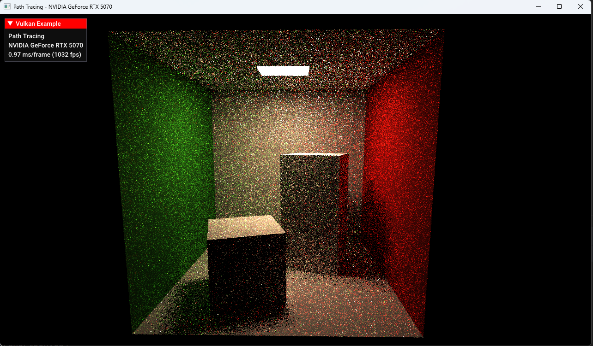
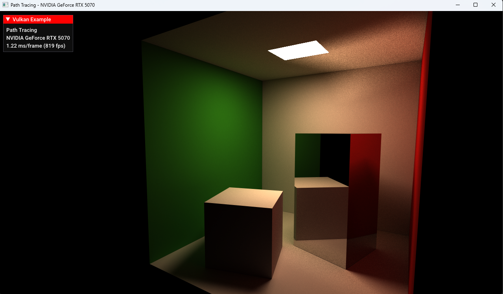
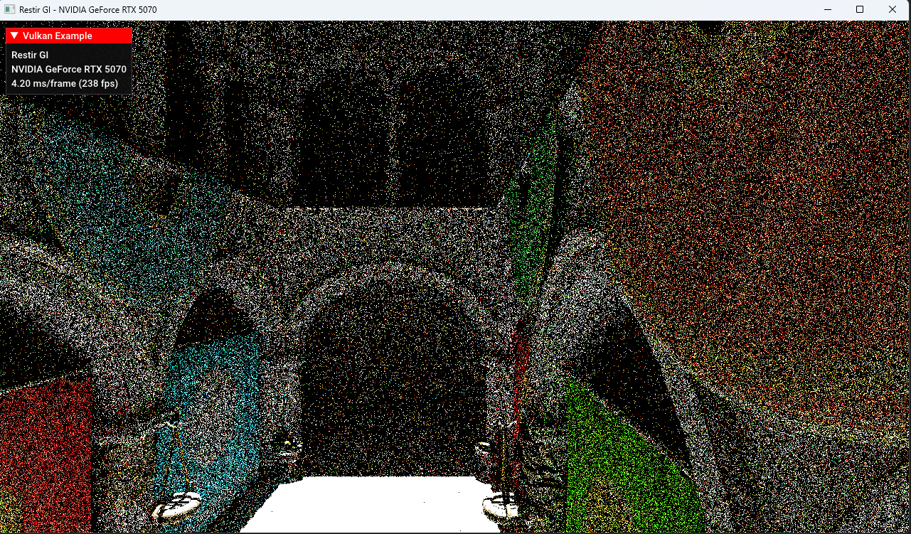
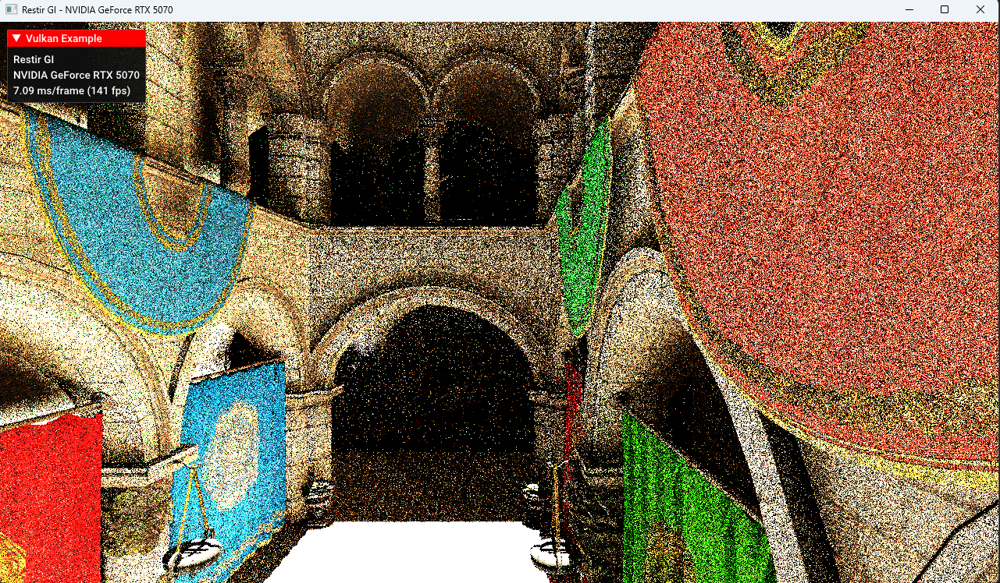
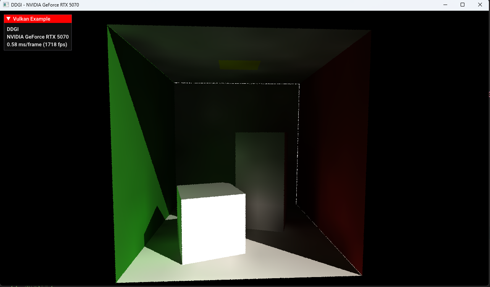

# Flower
A hardware-accelerated ray tracing engine using Vulkan

## Feature

- Monte Carlo Path Tracing
- Next Event Estimation
- Cosine-Weighted Importance Sampling
- Multiple Importance Sampling
- Lambertian Material && Mirror Material
- ReSTIR GI
- DDGI

Path Tracing(1 SPP) + Temporal Denosing:

Path Tracing(1 SPP) + Temporal Denosing:

Path Tracing(1 SPP):

ReSTIR GI:

Path Tracing(1024 SPP) / Reference:

DDGI:

