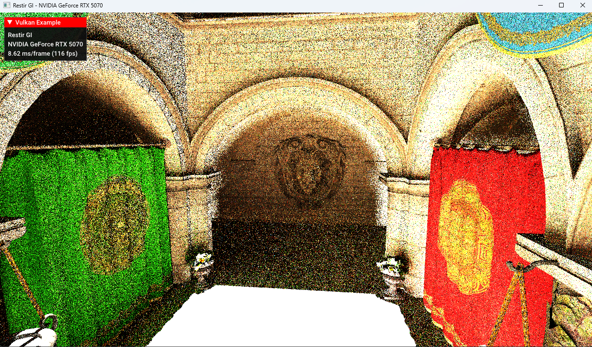

# Flower
A hardware-accelerated ray tracing engine using Vulkan

## Feature

- Monte Carlo Path Tracing
- Next Event Estimation
- Cosine-Weighted Importance Sampling
- Multiple Importance Sampling
- Lambertian Material
- Mirror Material
- ReSTIR GI

Path Tracing(1spp):

Path Tracing(1spp):

Path Tracing(1SPP):

ReSTIR GI:

Path Tracing(1024spp):

